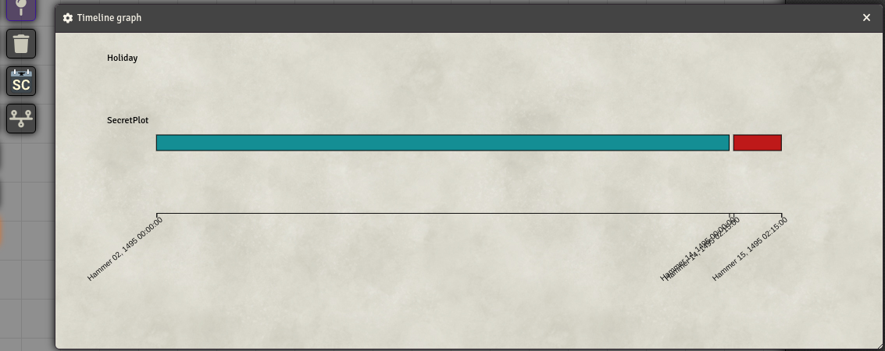

- 
- 
- 
- 

# Timeline

This module allows you to create a timeline from Simple Calendar nodes.  It require to use the simmple calendar module and will use the correct calendar used in the world.

It provides a dialog to decide which notes will end up in the dashboard.

If you want to support this work

